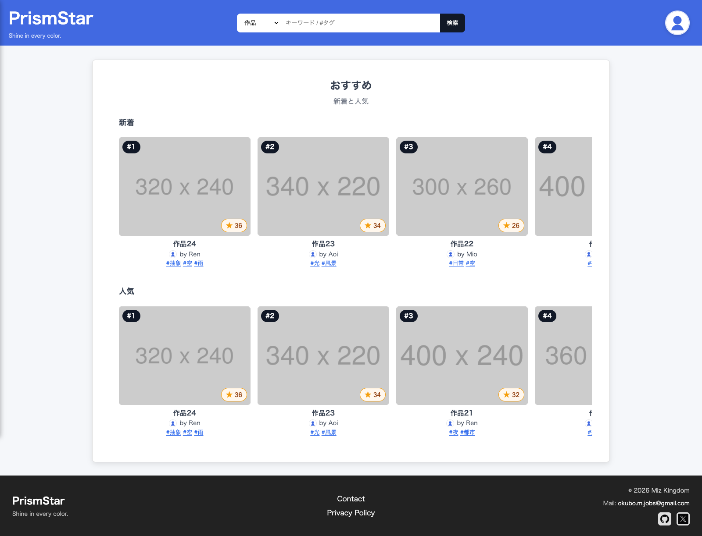
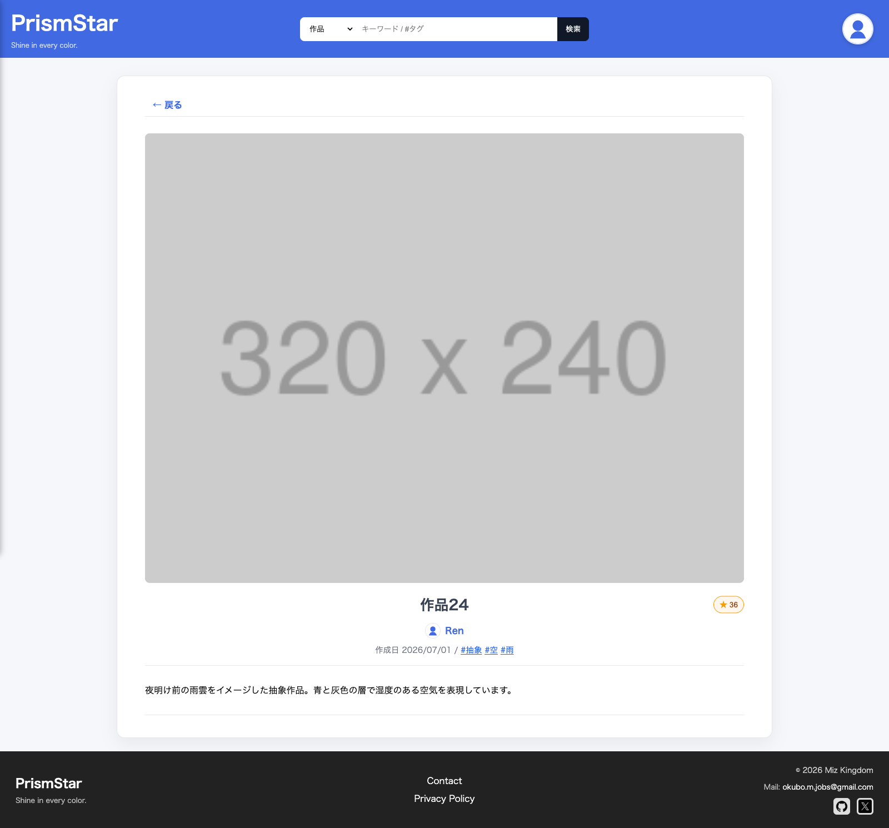
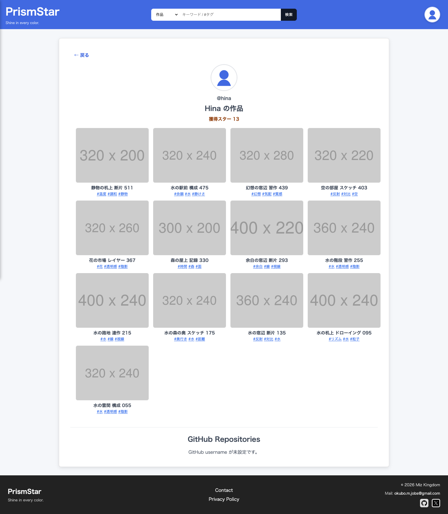
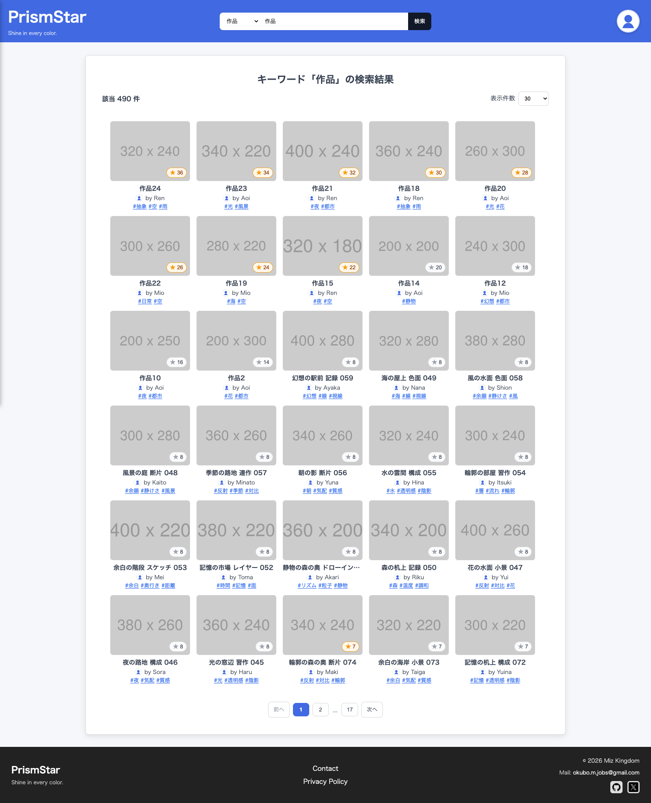

# PrismStar

**Shine in every color.**

「全員が発信者」のマルチユーザー作品プラットフォーム ＋ GitHub 連携。非エンジニアは画像・文字を、エンジニアは GitHub リポジトリを **同じ場で発信**でき、評価は **スター(⭐)** という一つの単位に集まる。

> 名前の由来：**Prism**（あらゆる色＝多様な発信者）＋ **Star**（目指せスター／お気に入り⭐）。一語でコンセプト（多様な発信・スター評価）を体現する。

> 来歴：新規に作ったものではなく、**去年 HTML/CSS/JavaScript で制作していた個人ギャラリー「Okubo Gallery（大久保の館）」を土台に、今年 PHP/MySQL/Docker・マルチユーザー認証・検索・GitHub 連携まで作り直したもの**。単発の制作物ではなく、継続して育ててきた作品として位置づけている。

---

## スクリーンショット

| おすすめ（新着・人気ランキング） | 作品詳細（スター・タグ・作者） |
|:---:|:---:|
| [](docs/assets/screenshot-recommend.png) | [](docs/assets/screenshot-detail.png) |
| **公開プロフィール（作品・獲得スター・GitHub 連携）** | **検索（総件数・表示件数切替・番号付きページング）** |
| [](docs/assets/screenshot-profile.png) | [](docs/assets/screenshot-search.png) |

> ※ サムネイルは説明用のプレースホルダ画像（placehold.jp）。詳細は下記「デモ / プレースホルダについて」。

## デモ / プレースホルダについて

ローカルで動かすデモには、説明のために以下の **ダミー（プレースホルダ）** を使っている。いずれも意図的なもので、本番では実データに差し替える前提：

- **作品のサムネイル画像** … [placehold.jp](https://placehold.jp) のプレースホルダ画像（`300x200` のような寸法入りのグレー画像）。実際の作品画像ではない。
- **未設定ユーザーのアイコン** … `public/image/default-avatar.svg`（汎用の人型アイコン）にフォールバック。
- **フッターの SNS リンク（X / GitHub）** … 実プロフィール URL 未設定のため、いまは各サービスのトップに向くダミー。

---

## 主な機能

- **発信（投稿）** — 画像/文字の作品を専用フォームで作成・編集。公開 / 非公開を切替（管理はマイページに集約・公開ページは閲覧専用）。
- **GitHub 連携** — 自分のリポジトリを取り込んで作品として発信（fork 除外・source/OG 画像を永続化）。token は **サーバ側に隠して** 安全に取得。
- **スター(⭐) ＋ お気に入り** — 作品にスターを付け、「お気に入り」で見返す。サイトのお気に入りと GitHub の star を **同じ単位** で扱う。
- **発見** — 検索（作品 / ユーザー / #タグ・**番号付きページング**：総件数表示・表示件数（10/30/50）切替・URL で検索状態を復元）と、トップの **新着・人気の2軸ランキング**（各トップ5のキュレーション）。
- **ユーザー** — 公開プロフィール（bio・その人の作品）、アイコン画像のアップロード / 差し替え、`@handle`。
- **認証** — 登録は **double opt-in**（メール確認）、パスワード再設定（メールトークン）、CSRF / セッション堅牢化。
- **レスポンシブ** — CSS 変数＋メディアクエリで 1〜複数列のグリッド。

画面・動線の詳細は [docs/spec/requirements-v2.md](docs/spec/requirements-v2.md)。

---

## 技術的なみどころ

ポートフォリオとして見てほしい所。判断の背景・**却下した代替案**まで [docs/adr/decisions.md](docs/adr/decisions.md)（ADR）に残してある。

- **GitHub token をサーバ側に隠す（＋SSRF対策）** — フロント直叩き（token がソースに露出 / 未認証 60 req/h）を却下し、PHP proxy 経由（env 秘匿 / 認証付き 5000 req/h）に。username を `^[A-Za-z0-9-]+$` に制限して SSRF を断つ。"なぜ安全か" を比較・却下理由ごと記録（ADR-003 / ADR-011）。
- **安全を「中央化」で効かせる** — CSRF トークンは fetch ラッパが状態変更系へ自動付与、セッション開始も共通化。**後から足した API も追加コードなしで保護**される（ADR-026 / ADR-028）。
- **発見系を役割で分ける情報設計** — 検索＝網羅（番号付きページング・総件数・表示件数切替）／トップ＝キュレーション（新着・人気の2軸）。扱う件数が増えた検索は「もっと見る」から番号ページへ見直し（規模が変われば決定も見直す）、トップは固定枠のまま。表示も役割に合わせ、検索は情報量優先で5列・小さめ／トップは大きく見せる（ADR-029 / ADR-044）。
- **操作モデルを疑って引き直す** — 「作品＝マイページ／人となり＝プロフィール」で個人系を再分節。実装済みでも "本当にこの操作モデルで正しいか" を作る前に疑う（ADR-030〜）。
- **「動くものを作り直さない」** — PHP + MySQL + Docker の動く資産を本体に選び、流行りで作り直さず伸ばした（ADR-001 / ADR-002）。
- **意思決定を ADR で残す** — 「何を・なぜ・何を却下したか」を固定し、**設計（handoff）と実装を分けて**進める開発フロー。

> 設計のこだわり・判断軸の全体像は **[docs/design/highlights.md](docs/design/highlights.md)**。

---

## 必要なもの

- Docker Desktop

## セットアップ

```bash
# 1. リポジトリをクローン
git clone <リポジトリURL>
cd Prism-Star

# 2. 環境変数ファイルを用意（必須・ローカル用の既定値入り）
cp .env.example .env

# 3. コンテナを起動
docker compose up -d

# 4. 初期データを投入（初回のみ）
docker compose exec app php /var/www/html/src/seed.php
```

> GitHub 連携を実際に試す場合のみ、`.env` に `GITHUB_TOKEN`（read-only の Personal Access Token）を入れる。無くてもアプリは起動・動作する。

## 使い方

ブラウザで http://localhost:8080/ を開く（`gallery-list.php` にリダイレクトされる）。

### ログイン

| 項目 | 値 |
|---|---|
| メールアドレス | demo@example.com |
| パスワード | password123 |

※ seed は **約40ユーザー / 約500公開作品**を決定的に生成（全員 `password123`）。検索のページング・総件数・タグ別件数や、所有モデル・人気ランキングが"賑わった"実データで見えるようにしている（ADR-045）。

### コンテナの停止・削除

```bash
docker compose down      # 停止
docker compose down -v   # データも含めて完全削除
```

---

## 技術構成

- **フロント**: HTML / CSS / Vanilla JS（フレームワーク・ビルドなし、`<template>` + JS で DOM 生成）
- **バックエンド**: PHP 8.2 (Apache) / MySQL 8.0（プリペアドステートメント前提）
- **開発環境**: Docker Compose（`app` + `db` の2コンテナ）

「なぜ採った / なぜ他を採らなかった」は [docs/design/highlights.md](docs/design/highlights.md)（技術スタックと選定理由）に併記。

## ドキュメント

- **[docs/design/highlights.md](docs/design/highlights.md)** — 設計のこだわり・判断軸・技術選定（読みどころの索引）
- **[docs/adr/decisions.md](docs/adr/decisions.md)** — 意思決定ログ（ADR：背景 / 決定 / 理由 / 代替案）
- **[docs/spec/spec.md](docs/spec/spec.md)** — 技術仕様（構成 / データモデル / API / セキュリティ）
- **[docs/spec/requirements-v2.md](docs/spec/requirements-v2.md)** — 要件・動線
- **[docs/ai-roles-and-workflow.md](docs/ai-roles-and-workflow.md)** — 開発の役割分担とワークフロー

---

## 公開範囲 / License

© 2026 mokubo1228-hub. ポートフォリオ閲覧用に一時公開しています。再利用・複製・改変の許諾はありません（All rights reserved）。
